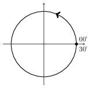

# Oscillazioni

Osservando, anche ad occhi chiusi, una ruota panoramica potremmo dire che completa una rotazione ogni 30 minuti. Osservando ancora il comportamento di questa ruota panoramica notiamo che questa compie un giro ogni 30 minuti, ovvero completa un ciclo di rotazione tornando al punto di partenza e poi ripete questa rivoluzione più volte. Questo è un esempio di funzione periodica, perché la ruota panoramica ripete la sua rivoluzione, o ciclo, ogni 30 minuti e quindi diciamo che ha un periodo di 30 minuti.

Osservate ancora la ruota panoramica, si muove in senso antiorario. C'è una sola cabina occupata, seguiamola. Volendo prendere nota dell'altezza di quella cabina durante i trenta minuti che impiega a tornare al punto di partenza, seguendola disegneremmo una linea, probabilmente verticale, che va dall'altezza minima all'altezza massima.

